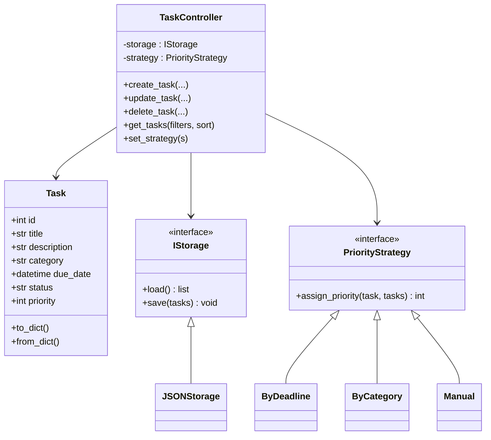
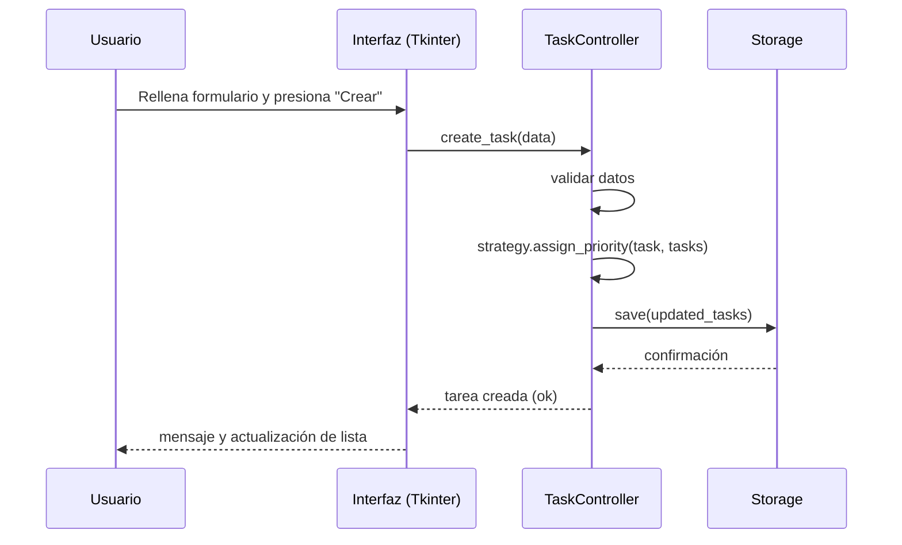

# Gestor de Tareas — Proyecto (README)

Alumno(es): Isaac Gomez, Carlos Gomez y Simon Serrano
Curso: Diseño de Software
Fecha: 18/11/25

---

## 1. Resumen del proyecto
Aplicación de escritorio en Python para crear, visualizar, editar, eliminar y organizar tareas personales o académicas. Soporta campos: "título", "descripción"", "categoría", "fecha límite", "estado" y "prioridad". Incluye filtros, ordenamientos y un módulo de priorización inteligente implementado con el Strategy Pattern. Interfaz gráfica con Tkinter. Persistencia de datos compatible con JSON.

---

## 2. Requisitos funcionales 
- CRUD de tareas.
- Filtros por categoría, estado, prioridad y fecha límite.
- Ordenamiento por varios criterios.
- Módulo de priorización seleccionable (estrategias: por fecha, por tipo/categoría, manual).
- Persistencia en JSON
- Interfaz gráfica con Tkinter.
- Tests unitarios para la lógica de negocio.
- Documentación: casos de uso, diagramas UML, explicación de decisiones y README técnico.

---

## 3. Estructura del repositorio
```
task_manager/
├─ main.py                 
├─ README.md              
├─ requirements.txt       
├─ src/
│ 
─ task.py
│  ├─ persistence/
│  │  ├─ data.json.py
│  │  
│  │  
│  ├─ prioritize/
│  │- strategy.py
│  │  
│  │
│  │  
│  ├─ controllers/
│  │  └─ task_controller.py
│  └─ gui/
│     └─ main_window.py
├─ tests/
│  └─ test_task_logic.py
└─ sample_data/
   └─ tasks_sample.json
```

---

## 4. Instalación (entorno local)
1. Clonar el repositorio:
   ```bash
   git clone <repo-url>
   cd task_manager
   ```
2. Crear entorno virtual (opcional pero recomendado):
   ```bash
   python -m venv venv
   source venv/bin/activate    # Linux / macOS
   venv\Scripts\activate       # Windows
   ```
3. Instalar dependencias (si las hay):
   ```bash
   pip install -r requirements.txt
   ```
> Nota: el proyecto puede funcionar con la librería estándar de Python (Tkinter y sqlite3). requirements.txt solo se usa si agregas librerías extra.

---

## 5. Ejecución
Para iniciar la interfaz gráfica (Tkinter):
```bash
python app.py
```
Para ejecutar pruebas:
```bash
pytest -q
```

---

## 6. Casos de uso 
1. Crear tarea: El usuario ingresa título, descripción, categoría, fecha límite y selecciona prioridad o deja que la estrategia asignadora la calcule.
2. Eliminar tarea Borrar tarea.
3. Persistencia y carga: Guardar y cargar tareas desde JSON

---

## 7. Diagrama de clases (Mermaid)


---

## 8. Diagrama de secuencia (Mermaid) — crear tarea


---

9. Decisiones de diseño y justificación
- Separación de responsabilidades: constants está desacoplado para facilitar pruebas y mantenimiento.
- Inyección de dependencias en controller: Task_Manager recibe la implementación de storage y la estrategia de prioridad; esto permite cambiar persistencia o estrategia sin modificar la lógica.
- Strategy Pattern:Elegido para encapsular algoritmos de priorización y permitir selección en tiempo de ejecución sin condicionales extensos.
- Persistencia flexible: Implementaciones JSON con interfaz común `IStorage` para permitir añadir otras fuentes en el futuro (p. ej. APIs).
- Tkinter: Suficiente para proyectos académicos, multiplataforma y disponible en la stdlib.


---

 10. Contratos/Esquema de persistencia 
Ejemplo de un archivo `tasks_sample.json`:
```json
[
  {
    "titulo": "Preparar informe",
    "descripción": "Informe final del proyecto",
    "categoria": "Trabajo",
    "fecha_limite": "2025-12-01T23:59:00",
    "status": "pendiente",
    "prioridad": 3
  },
  {
    "titulo": "Leer capítulo 4",
    "description": "Leer la celestina capitulo 4",
    "categoria": "Estudio",
    "Fecha_limite": "2025-11-25T18:00:00",
    "Estado": "en progreso",
    "Prioridad": 3
  }
]
```

---


---
